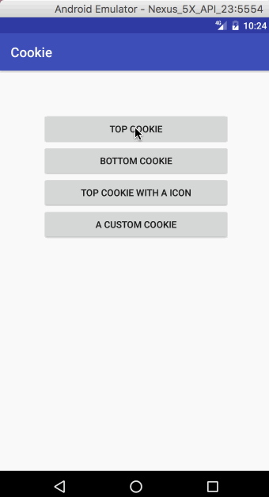
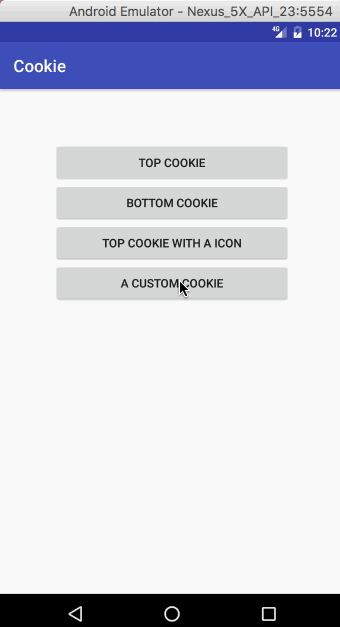

Cookie [](https://travis-ci.org/liuguangqiang/CookieBar)
==============================================
CookieBar is a lightweight library for showing a brief message at the top or bottom of the screen.

## Screenshot
 

## Usage
### Gradle

```
dependencies {
   	implementation 'com.liuguangqiang.cookie:CookieBar:1.0.1'
}
```

### Maven
```
<dependency>
  <groupId>com.liuguangqiang.cookie</groupId>
  <artifactId>CookieBar</artifactId>
  <version>1.0.1</version>
  <type>pom</type>
</dependency>
```

## A simple CookieBar.
```
 new CookieBar.Builder(MainActivity.this)
                        .setTitle("TITLE")
                        .setMessage("MESSAGE")
                        .show();
```

## A CookieBar with a icon and a action button.
```
 new CookieBar.Builder(MainActivity.this)
                        .setTitle("TITLE")
                        .setIcon(R.mipmap.ic_launcher)
                        .setMessage("MESSAGE")
                        .setAction("ACTION", new OnActionClickListener() {
                            @Override
                            public void onClick() {
                            }
                        })
                        .show();
```

## You can change the default style by set the Theme's attributes.

```
<style name="AppTheme" parent="Theme.AppCompat.Light.DarkActionBar">
   <item name="cookieTitleColor">@color/default_title_color</item>
   <item name="cookieMessageColor">@color/default_message_color</item>
   <item name="cookieActionColor">@color/default_action_color</item>
   <item name="cookieBackgroundColor">@color/default_bg_color</item>
</style>
```

## Or dynamically change the style with a cookie builder.
 * layoutGravity
 * backgroundColor
 * titleColor
 * messageColor
 * actionColor
 * duration

## New Features
#### 1.0.0
 * The action button could be replaced by a icon.

## License

    Copyright 2017 Eric Liu

    Licensed under the Apache License, Version 2.0 (the "License");
    you may not use this file except in compliance with the License.
    You may obtain a copy of the License at

       http://www.apache.org/licenses/LICENSE-2.0

    Unless required by applicable law or agreed to in writing, software
    distributed under the License is distributed on an "AS IS" BASIS,
    WITHOUT WARRANTIES OR CONDITIONS OF ANY KIND, either express or implied.
    See the License for the specific language governing permissions and
    limitations under the License.
